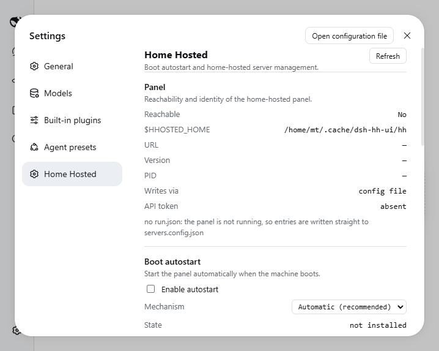

# dsh-home-hosted

A DeepSeek Harness plugin for [home-hosted](https://github.com/NamesMT/home-hosted): start the panel at boot, and manage its servers from inside dsh.



## What it does

- **Boot autostart** — installs, verifies and removes the OS entry that starts `home-hosted` at boot (systemd on Linux, launchd on macOS, Run key / Task Scheduler on Windows). Off by default; opt in from the plugin's page.
- **Server management** — add, edit, start, stop and restart home-hosted's servers without leaving dsh, with the panel's API as the write path so nothing is restarted behind your back.
- **Reclaim the harness** — a managed `dsh` entry gets `onPortConflict: kill`, so a leftover process holding the web port is reclaimed at boot instead of blocking forever.
- **Agent tools** — off by default, allowlisted one by one; every tool that changes something asks for approval first.

## Install

```sh
dsh plugin --profile web add dsh-home-hosted
```

Then open **Settings → home-hosted**.

## Configuration

The Cordis row config is for operator overrides only:

```yaml
- id: dsh-home-hosted
  name: 'dsh-home-hosted'
  config:
    stateDir: /custom/state/dir        # default: $DSH_HOME/dsh-home-hosted
    homeHostedCommand: /usr/bin/home-hosted
    defaultEntryId: dsh
```

Everything a person toggles lives in `<stateDir>/settings.json`.

## Notes

- A plugin cannot act at boot: it installs and re-syncs the OS entry while dsh runs, and the OS starts home-hosted from then on.
- The plugin ships its own `home-hosted` (pinned range) and drives that copy; a global install is only a fallback. Boot entries run a small stable launcher it writes, so a `node_modules` path that moves never breaks boot.
- Boot (pre-login) scope needs privilege somewhere — a system unit, or `loginctl enable-linger` on Linux. When the process cannot elevate, the page shows the exact commands to run by hand.
- The panel API token this plugin uses is minted on first write and kept 0600 under the plugin state directory; it is never rendered or logged.

## License

MIT
